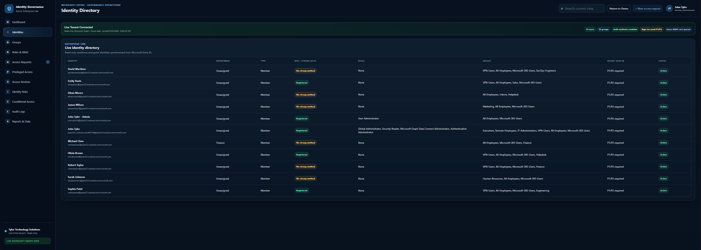

# Azure Identity Governance Console

A browser-based enterprise IAM governance simulation designed to demonstrate practical Microsoft Entra ID, Azure RBAC, privileged access, access-review, Conditional Access, and identity-risk concepts.

## What this project demonstrates

This project models workflows that appear in real identity governance and cloud-security environments:

- Full workforce and guest identity lifecycle management (create, edit, enable/disable, delete)
- MFA registration posture
- Editable security and Microsoft 365 groups with owner, membership type, and user membership management
- Editable Azure RBAC assignments with principal, role, scope, source, and privileged classification
- Access request and approval workflows
- Privileged Identity Management-style eligibility and activation controls
- Access reviews and recertification
- Identity-risk findings and remediation
- Conditional Access policy inventory
- Governance audit logging
- Local export/import of application state

The repository supports two distinct deployment contexts from the same codebase:

- **Public GitHub version:** a portfolio/demo deployment that uses sample governance data and browser-local state.
- **Azure enterprise version:** deployed to Azure Static Web Apps through GitHub Actions and protected by Microsoft Entra ID authentication against the configured Azure tenant.

The current application data layer is still browser-local and uses `localStorage`. This means Azure-hosted data persists separately from the public GitHub deployment because the two deployments use different origins, but the current version does **not** yet provide organization-wide shared persistence across different users or browsers. No tenant secrets, passwords, production identities, or Microsoft Graph data are stored in the repository.

## Deployment architecture

The project intentionally separates **source/deployment**, **authentication**, and **application data**.

```text
GitHub repository
      │
      ├── GitHub Pages
      │     └── Public portfolio/demo version
      │           └── Sample data + browser-local storage
      │
      └── GitHub Actions
            └── Azure Static Web Apps deployment
                  └── Microsoft Entra ID / OIDC authentication
                        └── Tenant-authenticated Azure version
                              └── Browser-local state for the current v1
```

### GitHub Actions → Azure deployment

The repository contains an Azure Static Web Apps GitHub Actions workflow. On pushes to `main`, GitHub Actions deploys the application to the Azure Static Web App using the repository's Azure Static Web Apps deployment secret.

The deployment workflow is the CI/CD path between GitHub and Azure. It should not be confused with end-user authentication: the workflow deploys the application, while Microsoft Entra ID authenticates users when they visit the Azure-hosted version.

### Live Tenant mode

The Azure-hosted console now supports an optional **Live Tenant** mode. The public GitHub Pages version remains a sample-data demo, while the tenant-authenticated Azure Static Web App can request read-only Microsoft Graph and Azure Resource Manager data.

Live Tenant mode can synchronize:

- Microsoft Entra users and UPNs
- account enabled/disabled state
- department where populated
- security and Microsoft 365 groups
- direct user membership counts
- group owners
- per-user registered authentication methods when permitted
- active Entra directory role assignments
- PIM active/eligible role schedule data when licensing exposes it
- recent directory audit activity
- recent sign-in information when Entra P1/P2 exposes Graph sign-in telemetry
- Azure RBAC assignments when a Subscription ID is configured

Live mode is intentionally **read-only**. Create/edit/delete controls remain part of the browser-local demo model and are not used to modify the real tenant.

### Live Tenant app registration requirements

Use a Microsoft Entra app registration configured as a **Single-page application (SPA)** and add the Azure Static Web App origin as a redirect URI.

Delegated Microsoft Graph permissions:

- `User.Read`
- `Directory.Read.All`
- `RoleManagement.Read.Directory`
- `AuditLog.Read.All`
- `UserAuthenticationMethod.Read.All`

For Azure RBAC inventory, also add Azure Service Management delegated:

- `https://management.azure.com/user_impersonation`

Grant tenant admin consent where required. The application does not store a client secret in browser code. The Tenant ID is the lab tenant and the Application/Client ID plus optional Subscription ID are stored locally as non-secret identifiers.

## Microsoft Entra ID authentication

The Azure Static Web App is configured with a tenant-specific OpenID Connect provider in `staticwebapp.config.json`. Unauthenticated requests are redirected to the Entra sign-in flow, and the application routes require the `authenticated` role.

This creates a company/tenant-facing version of the console that is separate from the public GitHub deployment. Tenant users and guests who are permitted to authenticate can access the Azure-hosted application.

**Azure resource-group RBAC and application sign-in are separate controls.** Having access to the Azure resource group does not automatically grant application access, and application access does not automatically grant Azure management permissions.

### Data persistence in the current version

The v1 console persists state with browser `localStorage`.

Because browser storage is scoped to the site's origin:

- data entered in the **Azure Static Web App** stays associated with the Azure-hosted application;
- data entered in the **public GitHub deployment** stays associated with the public deployment;
- the two deployments therefore maintain separate browser-local datasets.

However, this is **not yet shared organization-wide storage**. A second authorized user on another browser or device will not automatically see the first user's saved governance data.

To support a true shared company dataset for all authorized members, the next architecture step is:

```text
GitHub / CI-CD
      ↓
Azure Static Web Apps
      ↓
Microsoft Entra ID authentication
      ↓
Azure Functions / API
      ↓
Cosmos DB / Azure SQL
      ↓
Microsoft Graph (optional)
```

That design would allow authenticated organization members to work against the same centrally stored governance dataset while keeping the public GitHub demo isolated.

## Core modules

| Module | Enterprise concept |
| --- | --- |
| Dashboard | Governance posture and operational metrics |
| Identities | CRUD lifecycle management, MFA/risk attributes, roles, and group memberships |
| Groups | CRUD group lifecycle, owners, assigned/dynamic membership, and user memberships |
| Roles & RBAC | CRUD Azure RBAC assignments with principal, role, scope, source, and privilege classification |
| Access Requests | Entitlement approval workflow |
| Privileged Access | Just-in-time privilege / PIM concepts |
| Access Reviews | Periodic access recertification |
| Identity Risks | Identity hygiene and risk register |
| Conditional Access | Zero-trust access policy inventory |
| Audit Logs | Traceability of governance activity |
| Reports & Data | Demo-state portability and architecture notes |

## Local development

No build tool is required.

1. Clone the repository.
2. Open `index.html` locally, or serve the folder with a simple static web server.
3. Interact with the seeded demo data.
4. Changes made in the interface are persisted to the browser.

## GitHub Pages

This project is compatible with GitHub Pages because it is composed of static HTML, CSS, and JavaScript.

Enable Pages for the repository and publish from the main branch/root directory.

## Azure deployment

The Azure version is already deployed through the repository's GitHub Actions workflow to Azure Static Web Apps.

The Azure-hosted application is protected with tenant-specific Microsoft Entra ID authentication through OpenID Connect. The public GitHub deployment remains the portfolio/demo version, while the Azure deployment represents the tenant-authenticated enterprise context.

The current v1 still uses browser-local persistence. Shared multi-user organizational persistence would require the backend/API architecture described above.

## Azure Deployment Evidence

This screenshot shows the Azure-hosted version of the project deployed inside my `rg-azure-enterprise-lab` resource group. It highlights the supporting Azure resources used around the application, including the Static Web App deployment and related lab resources.



### What this demonstrates

- Azure resource group organization
- Deployment of the Azure Identity Governance Console in Azure Static Web Apps
- Visibility into supporting lab resources such as networking and monitoring components
- Practical experience navigating Azure Resource Manager and validating deployed resources

This supports the broader project goal of demonstrating identity governance concepts together with Azure deployment, access control, and cloud administration workflow familiarity.

## Security notes

This is a simulation and portfolio project.

- Do not place tenant secrets, client secrets, passwords, access tokens, or real privileged identity information in this repository.
- Browser storage is not appropriate for sensitive production IAM data.
- Real enterprise implementations require server-side authorization, secure API design, centralized logging, data protection, and proper identity-provider integration.
- Client-side role labels in this demo are visual representations only and are not security boundaries.

## Portfolio value

The application is intended to demonstrate understanding of:

- identity lifecycle and governance
- least privilege
- role-based access control
- privileged access management
- MFA and Conditional Access
- access reviews and entitlement governance
- auditability and security operations
- Azure application deployment and GitHub-based source control

## Author

Built by John Tyler as part of an Azure, IAM, systems administration, and cybersecurity portfolio.
